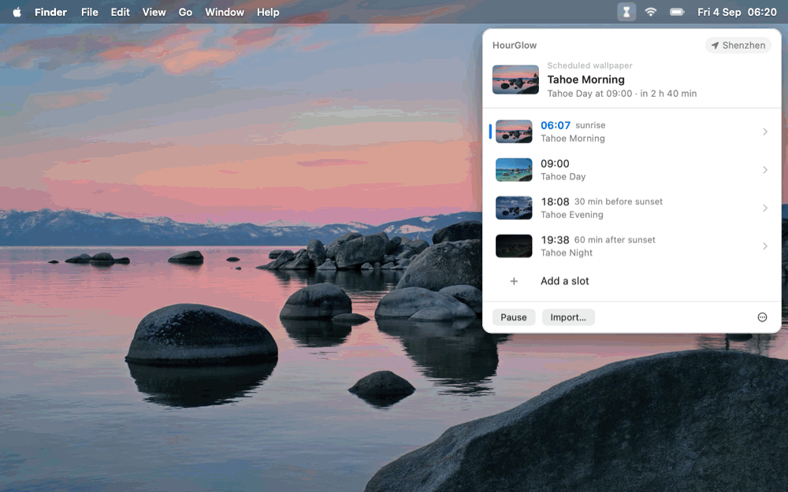

# HourGlow

> **English** · [中文](README.zh-CN.md)

[](https://github.com/bobbyhuang-dev/hourglow/actions/workflows/ci.yml)
[](https://github.com/bobbyhuang-dev/hourglow/releases/latest)
[](#requirements)
[](LICENSE)

<p align="center">
  
</p>

A macOS wallpaper scheduler that follows the daylight.

macOS Tahoe ships four dynamic wallpapers — Tahoe Morning / Day / Evening / Night — but
unlike older versions of macOS, it can no longer switch between them as the day goes on.
HourGlow fills that gap. Rather than hardcoding those four, it is a general
"trigger → wallpaper" scheduler: you define any number of time slots, bind a wallpaper to
each, and it handles switching at the right moment.

Lives in the menu bar, no Dock icon. Swift 6.3 + SwiftUI, zero third-party dependencies,
under 5 MB. Speaks English and 简体中文.

## Features

- **Three kinds of trigger** — a fixed clock time, relative to sunrise/sunset with a
  signed offset (e.g. "30 minutes before sunset"), or a solar-phase slice that
  evenly divides today's twilight / day / night window by how many frames that
  phase has (the 24 Hour Wallpaper model)
- **Two wallpaper sources** — any of the 156 system aerials, or a local image file
- **Any number of slots** — the Tahoe four are just the preset written on first launch;
  edit or delete them freely
- **Sun times computed locally** — the NOAA solar position algorithm, no network. Coordinates
  come from a one-shot system location fix, a city you pick, or a latitude/longitude you
  type in; with none of those, they are inferred from your time zone, which needs no
  permission at all. China is a single `Asia/Shanghai` zone, so picking Shenzhen vs Shanghai
  actually changes sunrise by tens of minutes.
- **No polling** — the timer is scheduled directly at the next trigger point. Sleep/wake,
  system clock changes, time zone changes and day rollover each have their own notification,
  so sleeping through a trigger means the wallpaper catches up on wake
- **It won't fight you** — if you change the wallpaper yourself in System Settings, HourGlow
  won't silently undo it on the next in-place re-evaluation. Your manual pick stands until
  the next scheduled switch (see below)
- **Edits are staged** — changing a slot's time or wallpaper only builds up a draft; nothing
  is written to the schedule, and no wallpaper changes, until you hit Apply
- **Launch at login** — a login item registered through `SMAppService`, visible and
  switchable in System Settings › Login Items
- **Built-in updates** — check manually or let HourGlow check GitHub Releases daily,
  verify the download and code signature, install it in place, and relaunch itself
- **Human-readable JSON config** — edit `schedule.json` by hand and the engine follows
  immediately
- **English and 简体中文** — follows your system language by default; the panel, the guide and
  the CLI all switch together. Adding a language is one file and one line —
  see [Adding a language](CONTRIBUTING.md#adding-a-language)
- **A guided first launch** — five steps that show where the menu bar icon is, which
  permissions to grant and what the system dialogs will look like, how to set your location
  (or skip the permission and just pick a city), and how to read the timeline. Skippable at
  any point, and reachable again from the ⋯ menu
- **Import a 24-hour wallpaper set** — files named with sunrise / morning / day / sunset /
  evening / night (or `01_sunrise_1.heic`, or a 24 Hour Wallpaper `.sundialScene`), or sorted
  into per-phase subfolders (`sunrise/1.jpg`), become a full-day timeline that tracks local
  sun times. Each phase can have a different number of frames. Importing replaces the whole
  timeline and asks first; files whose phase cannot be determined are left out and reported
  back to you.

## Download

**[⬇ Download the latest release](https://github.com/bobbyhuang-dev/hourglow/releases/latest)**
— grab `HourGlow-x.y.z.zip`, unzip it, drag `HourGlow.app` into `/Applications`.

The app is ad-hoc signed but *not notarized* (no paid Apple developer account), so macOS
blocks the first launch. Clear the quarantine flag once:

```bash
xattr -dr com.apple.quarantine /Applications/HourGlow.app
```

Or double-click it once and then allow it under **System Settings › Privacy & Security ›
Open Anyway**.

It then lives in the menu bar — no Dock icon, no window. A brand-new install opens a
five-step guide the first time: where the icon went, granting location access (or skipping it
and picking a city instead), launch at login, and how to read the timeline. Skip it whenever
you like — the ⋯ menu and the settings page both lead back to it. That same first launch
writes the Tahoe four-slot preset; edit or delete those freely. To have HourGlow come back
after a reboot, turn on **Launch at login** — step 3 of the guide, or the settings page
(the ⋯ menu).

Automatic updates are on by default. The settings page can turn them off, check manually,
or install an available release immediately. Updates keep the app at its current location,
so move it into `/Applications` before enabling Launch at login.

Current builds use a stable code identity and a new bundle identifier to avoid a macOS 26
Control Center bug that could hide an updated ad-hoc-signed menu bar app even while Settings
showed it as allowed. Schedules from older builds are kept, but you may need to grant location
access and enable **Launch at login** once again after this identity migration.

`hourglow-cli-x.y.z.zip` on the same page is the optional command line tool (see below);
drop the binary anywhere on your `PATH`.

## Safety and how it works

HourGlow does one thing to your Mac: it changes the wallpaper. Here is exactly what that
involves, so you can decide whether to trust it.

- **What it changes.** macOS keeps wallpaper settings in
  `~/Library/Application Support/com.apple.wallpaper/Store/Index.plist`. HourGlow reads that
  file, replaces the wallpaper entry, writes it back, and restarts `WallpaperAgent` so the
  change shows. Fields it doesn't understand are kept as they were, the slot is always written
  as `linked` (desktop and screen saver together), and the write is skipped when the file
  already says what it should — no flicker. This is not a public API; a macOS update could
  change the format.
- **Backup first.** Every write starts by copying that file to `Index.plist.hourglow.bak`
  next to the original. If the backup fails, nothing is written. To undo by hand: quit
  HourGlow, copy the backup back over `Index.plist`, run `killall WallpaperAgent` — or just
  pick a wallpaper in System Settings.
- **Its own files.** The schedule, engine state and imported wallpaper sets live in
  `~/Library/Application Support/HourGlow/`; logs in `~/Library/Logs/HourGlow*.log`; update
  downloads in `~/Library/Caches/HourGlow/` (cleaned up after install); the language and
  "seen the guide" flags in its preferences. It reads the system's aerial catalog for names
  and thumbnails. Nothing else on disk is touched.
- **Permissions.** None are required. Location is optional: if you grant it, the app takes
  one fix, stores it in `schedule.json` as a plain latitude/longitude, and never asks again;
  decline it and pick a city or type coordinates, or let it infer from your time zone. Launch
  at login is an ordinary login item, visible and switchable in System Settings › General ›
  Login Items. No Accessibility, no Full Disk Access, no screen recording.
- **Sun times are computed on your Mac** with the NOAA solar position algorithm. No sun-time
  service is ever contacted.
- **What goes over the network.** With automatic updates on (the default), HourGlow asks
  `api.github.com` once a day for the latest release and, when you install one, downloads it
  from GitHub. Typing a place name the built-in city list doesn't know geocodes it through
  Apple's MapKit and, failing that, OpenStreetMap's Nominatim. That is the complete list: no
  telemetry, no analytics, no account. Turn automatic updates off in Settings and the app
  makes no requests on its own.
- **Updates are verified** before anything is replaced: the download's SHA-256 against the
  release's asset digest, then the unpacked app's bundle identifier, version and full code
  signature. The old app is kept as a backup until the new one has launched.
- **Not notarized.** Releases are ad-hoc signed by the build script — there is no paid Apple
  developer account behind this — which is why macOS asks once on first launch. If you'd
  rather not trust a binary, [build from source](#build-from-source); it takes one command.

## Requirements

macOS 26 (Tahoe) or later. Building from source needs only the command-line Swift toolchain
(`xcode-select --install`), not the full Xcode.

## Build from source

```bash
git clone https://github.com/bobbyhuang-dev/hourglow.git
cd hourglow
./build.sh
open build/HourGlow.app
```

`build.sh` compiles with `swiftc` and assembles the `.app` by hand (ad-hoc signed — fine for
personal use); there is no Xcode project. The signature carries an explicit, stable designated
requirement so rebuilding or upgrading does not create a new menu-bar identity on macOS 26.
Everything lands in `build/`. Every push is built and checked the same way by GitHub Actions
(`.github/workflows/ci.yml`); pushing a `v*` tag builds, verifies and publishes a release
(`.github/workflows/release.yml`).

## Command line

`hourglow-cli` is the troubleshooting entry point, and doubles as a headless daemon:

```bash
./build/hourglow-cli now                 # what should be active now, next switch, whether reality agrees
./build/hourglow-cli list                # the timeline, with today's actual times per slot
./build/hourglow-cli catalog Space       # list system aerials (with download state and size)
./build/hourglow-cli simulate 2026-12-21 # time travel: print every switch across that day
./build/hourglow-cli solar               # today's sunrise, sunset, nautical dawn, civil dusk
./build/hourglow-cli location 深圳       # set coordinates by city name
./build/hourglow-cli language en         # UI and CLI language (prints the current one if given nothing)
./build/hourglow-cli import ~/Pictures/zhangjiajie   # folder of stills → solar-phase timeline
./build/hourglow-cli apply --dry-run     # show what would be written, without writing
./build/hourglow-cli run                 # run the engine in the foreground
./build/hourglow-cli agent install       # register as a LaunchAgent, survives reboot (headless use)
```

Launch-at-login and location can't be asked of the CLI: the login item is registered for —
and location permission granted to — *the caller's own bundle*, and the CLI is a bare
binary. The same goes for the onboarding guide, whose "already seen" flag lives in the app's
`UserDefaults` rather than in the config directory. Those entry points live on the app's
executable:

```bash
build/HourGlow.app/Contents/MacOS/HourGlow --login-item status   # status | on | off
build/HourGlow.app/Contents/MacOS/HourGlow --locate              # one fix, printed, never written to the config
build/HourGlow.app/Contents/MacOS/HourGlow --guide status        # onboarding: status | reset | show
```

`--guide status` prints whether this launch would show the guide and why, `--guide reset`
forgets that you have seen it, and `--guide show` opens it right now.

The menu bar app and `hourglow-cli run` compete for the same single-instance lock: whichever
starts first owns scheduling, the other falls back to follower mode — it only edits the
config, and the leader picks the change up.

## Language

HourGlow ships in English and Simplified Chinese, and follows your system language. If it
matches neither, you get English.

To pin one instead, use the settings page — ⋯ menu › Settings › Language — or the CLI. The
app and the CLI share the setting, and the panel switches immediately, without a restart:

```bash
hourglow-cli language            # what is in effect, what is stored, what is available
hourglow-cli language en         # pin English
hourglow-cli language system     # back to following the system
```

`HOURGLOW_LANG=en hourglow-cli list` overrides both, for one command, without changing
anything — useful for a screenshot or a bug report.

**Adding a language** takes one new file in `Sources/L10n/Catalogs/` and one line in
`Sources/L10n/L10n.swift` — no Swift beyond filling in a dictionary, and a check binary that
tells you exactly what is still missing.
[CONTRIBUTING.md › Adding a language](CONTRIBUTING.md#adding-a-language) walks through it.
Translations are very welcome.

## Who wins when you change the wallpaper yourself

You may well go into System Settings and pick a different wallpaper. HourGlow decides based
on whether a new trigger boundary has been crossed:

- **Crossed** (a trigger fired, you slept through one, or the schedule was resumed from
  pause) — write as usual. Your manual pick is valid until the next scheduled switch, the
  same way a thermostat's "temporary hold" works.
- **Not crossed** (launch, wake, time zone change — any in-place re-evaluation) — write only
  if the current wallpaper is still the one HourGlow last wrote. Otherwise it stands down
  rather than silently erasing the choice you made ten minutes ago.

## Configuration

`~/Library/Application Support/HourGlow/schedule.json`, safe to edit by hand:

```json
{
  "paused": false,
  "slots": [
    {
      "id": "…",
      "enabled": true,
      "trigger": { "type": "solar", "event": "sunrise", "offsetMinutes": 0 },
      "wallpaper": { "type": "aerial", "assetID": "B2FC91ED-6891-4DEB-85A1-268B2B4160B6" }
    },
    {
      "id": "…",
      "enabled": true,
      "trigger": { "type": "clock", "hour": 9, "minute": 0 },
      "wallpaper": { "type": "image", "path": "/Users/you/Pictures/noon.heic" }
    },
    {
      "id": "…",
      "enabled": true,
      "trigger": { "type": "solarPhase", "phase": "sunrise", "index": 0, "count": 3 },
      "wallpaper": { "type": "image", "path": "/Users/you/Library/Application Support/HourGlow/Scenes/zhangjiajie/sunrise_1.heic" }
    }
  ]
}
```

Other runtime paths: `state.json` and the single-instance lock `run.lock` sit in the same
directory; the LaunchAgent logs to `~/Library/Logs/HourGlow.log`. The whole config directory
can be moved with the `HOURGLOW_HOME` environment variable — handy for trying things out on a
throwaway config, leaving the real one alone.

## Verification

There is no XCTest. Verification runs through a few separately compiled check binaries, all
offline, none of which touch your real wallpaper:

```bash
./build/modelcheck             # resolution: midnight wraparound, solar triggers, solar-phase windows, Codable compatibility
./build/enginecheck            # engine: the assert-vs-stand-down matrix, and timer scheduling
./build/importcheck            # import: 24 Hour Wallpaper filenames, multi-resolution scenes, even split
./build/appcheck               # app state: drafts, save boundaries, external config conflicts, onboarding rules
./build/appstartupcheck        # damaged-config startup and automatic recovery (about 30 seconds)
./build/updatecheck            # updater: SemVer ordering, Release parsing, SHA-256
./build/l10ncheck Sources      # strings: nothing missing, empty or extra; placeholders match; every key used in code exists
bash Tests/verify-updater-helper.sh build/HourGlow.app/Contents/Helpers/HourGlowUpdater
bash Tests/verify-app-signature.sh build/HourGlow.app   # signature and its stable designated requirement
python3 Tests/verify-solar.py  # sun times cross-checked against the ephem ephemeris (10 cases, max deviation 4s)
python3 Tests/verify-cli-boundaries.py # invalid input and 23/25-hour daylight-saving days
./build/panelshot ~/Desktop    # render every panel page plus the guide's five steps to PNG, for comparing layout changes
```

## Status

Stable, and in daily use. **1.5 is the current release** — a today's-daylight bar on the
timeline, a lighter idle footprint, and an updater that respects GitHub rate limits and moved
bundles. 1.4 added English alongside the Simplified Chinese it started in, 1.3 a guided first
launch, 1.2 24 Hour Wallpaper import and solar-phase scheduling, 1.1 built-in updates, and 1.0
covered the scheduling engine, the menu bar UI, launch at login and precise location.

Implementation notes live in [CLAUDE.md](CLAUDE.md): the layering, the verified facts about
the macOS wallpaper store, and the mistakes already made once so they don't get made again.
That file is in Chinese, as are the source comments. The user-visible strings are not — they
all live in `Sources/L10n/`.

### Not planned

Deliberately out of scope, so you know what you're getting:

- per-display or per-Space wallpapers — the desktop and the screen saver always change
  together, because HourGlow writes the slot as `linked`
- controlling desktop and screen saver separately
- random or folder shuffle
- triggers based on light/dark mode, weather, or Focus
- lock screen wallpaper
- exporting or syncing the whole schedule (importing a wallpaper *set* is supported; this
  means `schedule.json` itself)

## Contributing

Bug reports, feature requests and pull requests are welcome — see
[CONTRIBUTING.md](CONTRIBUTING.md) for how to build, how to verify a change, and the
conventions this codebase follows (notably: comments and documentation are written in Chinese,
while every user-visible string lives in `Sources/L10n/`).

Translating HourGlow into another language is the smallest useful contribution there is: copy
one file, fill in a dictionary, add one line.
[Adding a language](CONTRIBUTING.md#adding-a-language) has the details.

Found a security problem? Don't open a public issue — [SECURITY.md](SECURITY.md) explains how
to report it privately.

## License

[Apache License 2.0](LICENSE). Copyright 2026 Bobby Huang.
